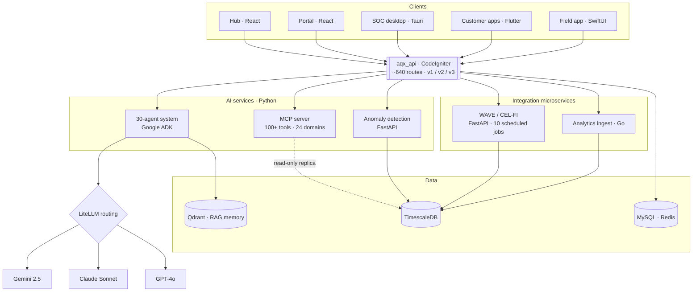
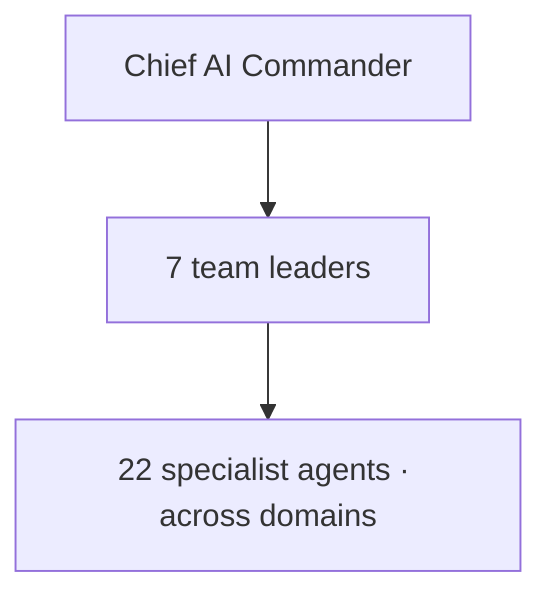

# Amplifi-Qx

**The platform that runs an entire signal-booster business — end to end.**

Amplifi-Qx is a vertically-integrated B2B SaaS platform for Signal Solutions, a mobile-signal-booster (Nextivity CEL-FI / WAVE) installation and service company. It runs the business end to end: CRM, sales proposals, site surveys, field-installation workflow, hardware and site monitoring, finance, HR, partner management, customer self-service — and an internal AI-agent layer threaded across all of it. Its users span internal staff, field engineers, installation partners and end customers.

It isn't one app. It's a **21-project, 8-language** estate of cooperating services, web apps, mobile apps, a desktop app and AI services, arranged hub-and-spoke around a single API.

> This repository is a **showcase**: architecture, design and engineering write-up only. The source is commercial and private — a walkthrough or supervised code read is available on request.

---

## Architecture

A single CodeIgniter API is the source of truth; every client, AI service and integration microservice consumes it rather than touching the database directly.

## The AI layer

A hierarchical **30-agent** organisation coordinates work across the platform:

Built on Google ADK with multi-provider routing via LiteLLM — Gemini 2.5 primary, Claude Sonnet and GPT-4o as fallback — and Qdrant-backed RAG memory (conversation history, company knowledge base, user preferences) behind a safe-memory wrapper.

---

## Selected engineering

- **Hub-and-spoke architecture.** One CodeIgniter API (v1 / v2 / v3 namespaces) is the single source of truth; mobile apps, portals, the MCP server and integration services all consume it, never the database directly.
- **30-agent hierarchical AI system.** A Chief AI Commander → 7 team leaders → 22 specialists, on Google ADK, with LiteLLM multi-provider routing and Qdrant RAG memory.
- **MCP server.** Exposes 100+ department-scoped tools across 24 domains to external LLMs, with prefix / exact / row-level ACLs, token-bucket rate limiting and Pydantic response guards, reading a read-only TimescaleDB replica.
- **Resilient hardware integration.** The WAVE / CEL-FI service runs 10 scheduled jobs behind a circuit breaker, token-bucket rate limiter, monthly credit tracker, idempotency guards and full audit logging.
- **Statistical anomaly detection.** MAD-based z-scores, IQR and seasonal decomposition applied to Xero finance transactions and cellular-signal readings — classical ML, no LLM required.
- **Secure by design.** Tenant-scoped search tokens, httpOnly-cookie sessions, constant-time API-key comparison with hashed fingerprints in logs, build-time secret scrubbing from client bundles, and TimescaleDB compression / retention policies.

## Tech stack

| Tier | Built with |
|---|---|
| **Backend / APIs** | PHP 8.3 · CodeIgniter 4.7 · Python 3.12 · FastAPI · Go 1.25 |
| **Front-end / apps** | React 19 · Vite · Rust / Tauri (desktop) · Flutter / Dart · Swift / SwiftUI · Astro |
| **AI / ML** | Google ADK · LiteLLM (Gemini · Claude · GPT-4o) · Qdrant (RAG) · OpenAI Whisper · statistical anomaly detection |
| **Data** | MySQL 8 · Redis · TimescaleDB (hypertables) · Qdrant · Appwrite · Meilisearch · Directus |
| **Integrations** | Xero · Google Workspace · WhatsApp Business · TP-Link Omada · Firebase · Mux · n8n · PostHog … |
| **Quality** | PHPUnit · Cypress · Playwright · pytest · XCTest · Semgrep · PHPStan (L6) · Rector |

## At a glance

| | |
|---|---|
| Sub-projects | **21** across 8 language ecosystems |
| API routes | **~640** (core API) + **200+** (Hub) |
| AI agents | **30** (1 → 7 → 22 hierarchy) · 3 LLM providers |
| MCP tools | **100+** across 24 domains |
| External integrations | **30+** |
| Testing | 184 Cypress E2E specs · ~240 PHPUnit · 130+ pytest |
| CI | **140+** GitHub Actions workflows · Semgrep |
| Active | 2023 → present |
| Built by | **1** engineer, solo |

---

Source is commercial and private. Architecture walkthrough or supervised code read available on request — **john@johncbaker.co.uk** · [github.com/johncbaker](https://github.com/johncbaker)
